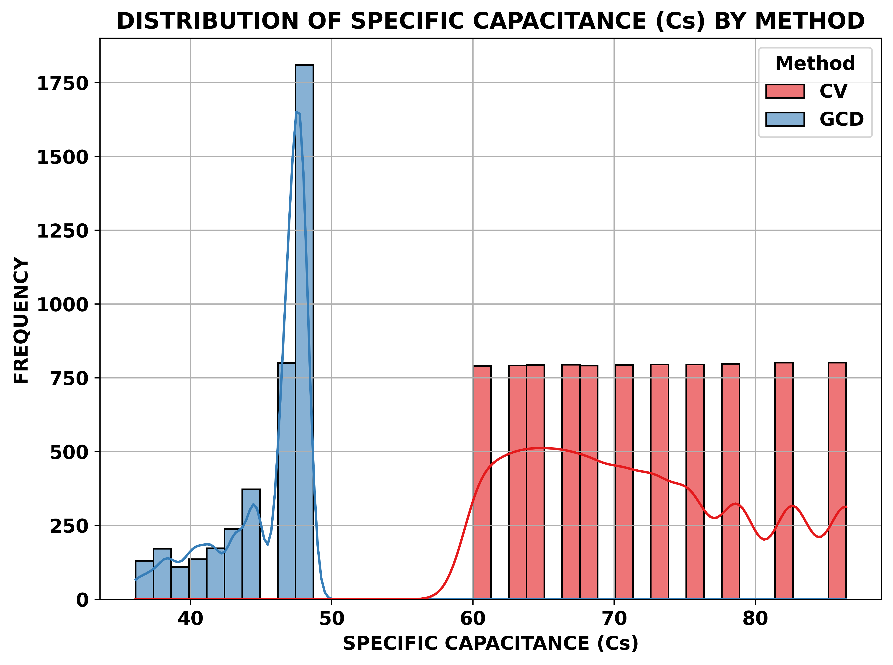
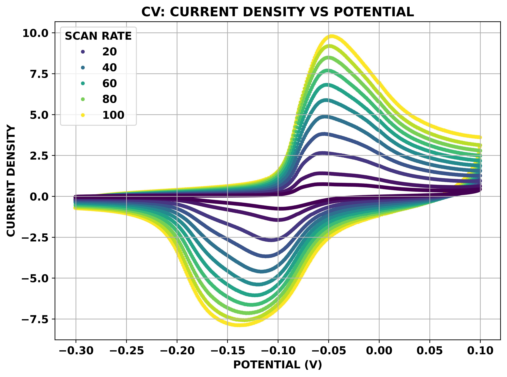
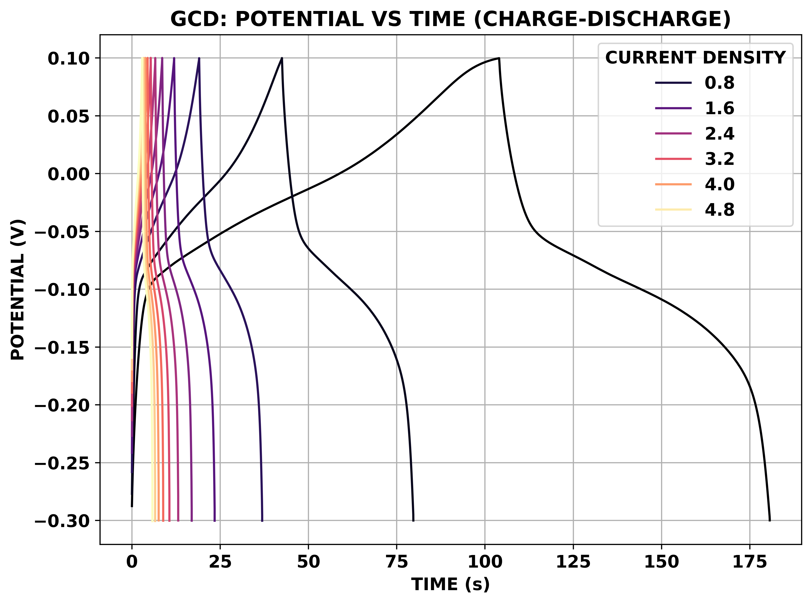
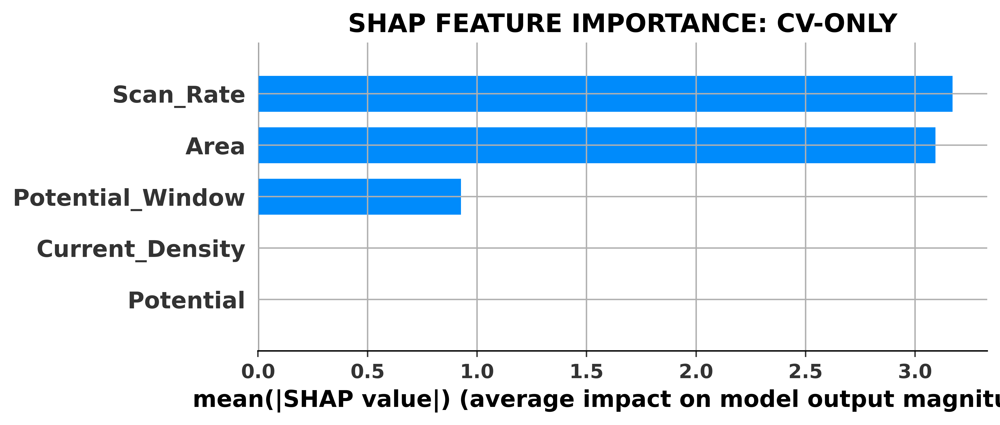
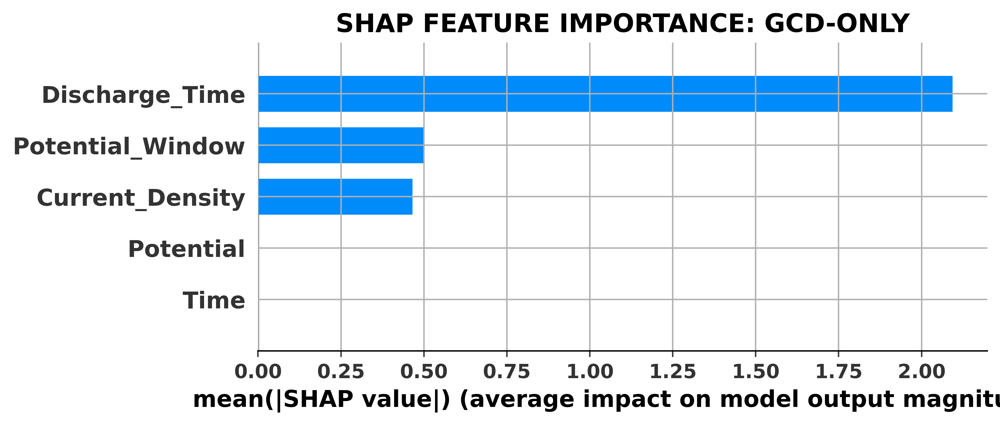

# 🔋 ELECTROCHEMICAL MACHINE LEARNING: AL2O3 CAPACITANCE ANALYSIS

  
  
   
  
  
  
  
   
  

<h1 align="center">MACHINE LEARNING–BASED ANALYSIS AND COMPARISON OF SPECIFIC CAPACITANCE</h1>

> 
<b>DECODING BATTERY PHYSICS THROUGH DATA SCIENCE.</b>

A FULL-SCALE DATA ANALYSIS AND MACHINE LEARNING PIPELINE DESIGNED TO UNCOVER THE ELECTROCHEMICAL KINETICS OF **$Al_2O_3$ IN 1M KOH**. THIS PROJECT INGESTS, CLEANS, AND MODELS CYCLIC VOLTAMMETRY (CV) AND GALVANOSTATIC CHARGE-DISCHARGE (GCD) DATA TO PREDICT SPECIFIC CAPACITANCE ($C_s$) AND QUANTIFY THE METROLOGICAL BIAS BETWEEN TESTING METHODS USING ADVANCED **SHAP** ANALYSIS.

**🚀 LEAKAGE-FREE, GROUP-SPLIT ARCHITECTURE FOR TRUE PHYSICS DISCOVERY**

---

## 📖 TABLE OF CONTENTS

- [🔋 ELECTROCHEMICAL MACHINE LEARNING: AL2O3 CAPACITANCE ANALYSIS](#-electrochemical-machine-learning-al2o3-capacitance-analysis)
  - [📖 TABLE OF CONTENTS](#-table-of-contents)
  - [📘 PROJECT OVERVIEW](#-project-overview)
  - [✨ KEY FEATURES](#-key-features)
    - [LEAKAGE-FREE MODELING](#leakage-free-modeling)
    - [METHODOLOGY UNIFICATION](#methodology-unification)
    - [ABLATION \& SENSITIVITY STUDY](#ablation--sensitivity-study)
    - [PHYSICS-ML INTERPRETATION (SHAP)](#physics-ml-interpretation-shap)
    - [PUBLICATION-QUALITY VISUALIZATIONS](#publication-quality-visualizations)
  - [👁️ VISUAL SHOWCASE](#️-visual-showcase)
    - [1. DISTRIBUTION AND EDA](#1-distribution-and-eda)
    - [2. RATE CAPABILITY ANALYSIS](#2-rate-capability-analysis)
    - [3. MODEL BENCHMARKING](#3-model-benchmarking)
    - [4. SHAP EXPLAINABILITY](#4-shap-explainability)
  - [⚙️ SYSTEM ARCHITECTURE](#️-system-architecture)
  - [⚙️ HOW IT WORKS](#️-how-it-works)
  - [🧱 TECH STACK](#-tech-stack)
  - [🏁 USAGE](#-usage)
  - [📈 RESULTS AND SCIENTIFIC CONCLUSIONS](#-results-and-scientific-conclusions)
  - [🚀 FUTURE WORK](#-future-work)
  - [📄 LICENSE](#-license)
  - [📦 INSTALLATION INSTRUCTIONS](#-installation-instructions)

---

## 📘 PROJECT OVERVIEW

IN MATERIALS SCIENCE, MEASURING THE ENERGY STORAGE CAPACITY (SPECIFIC CAPACITANCE) OF A NOVEL ELECTRODE OFTEN YIELDS CONFLICTING RESULTS DEPENDING ON THE INSTRUMENT USED. TRADITIONAL ANALYSIS RELIES ON MANUAL PLOTTING AND SIMPLE LINEAR REGRESSION, WHICH FAILS TO CAPTURE COMPLEX, MULTIVARIATE KINETIC LIMITATIONS.

THIS SYSTEM ADDRESSES THE PROBLEM BY DEPLOYING A **TREE-BASED MACHINE LEARNING PIPELINE** TO MODEL THE CAPACITANCE OF AN $Al_2O_3$ ELECTRODE. IT EXTRACTS DATA FROM BOTH CV (DYNAMIC VOLTAGE SWEEP) AND GCD (STATIC CURRENT HOLD) EXPERIMENTS, UNIFIES THEIR KINETIC PARAMETERS, AND USES ALGORITHMS LIKE **GRADIENT BOOSTING** TO PROVE EXACTLY WHICH PHYSICAL VARIABLE—OR WHICH MACHINE—DICTATES THE FINAL ENERGY CALCULATION.

THE ENTIRE PIPELINE IS BUILT IN PYTHON, UTILIZING **GROUPSHUFFLESPLIT** TO PREVENT TIME-SERIES DATA LEAKAGE AND ENSURE HIGH-FIDELITY PREDICTIONS UNSEEN EXPERIMENTAL CONDITIONS.

---

## ✨ KEY FEATURES

### LEAKAGE-FREE MODELING

- USES **`GroupShuffleSplit`** IN SCIKIT-LEARN TO ENSURE ENTIRE EXPERIMENTAL RUNS (E.G., ALL DATA FOR A 5 mV/s SCAN) ARE KEPT STRICTLY IN EITHER THE TRAINING OR TESTING SET, PREVENTING ARTIFICIAL $R^2 = 1.0$ OVERFITTING COMMON IN TIME-SERIES ELECTROCHEMISTRY.

### METHODOLOGY UNIFICATION

- SYNTHESIZES A **`Kinetic_Rate_Parameter`** THAT MATHEMATICALLY ALIGNS THE SCAN RATE (CV) WITH CURRENT DENSITY (GCD). THIS ALLOWS A SINGLE COMBINED ML MODEL TO FAIRLY EVALUATE THE DRIVING FORCE OF THE EXPERIMENT REGARDLESS OF THE TESTING METHOD.

### ABLATION & SENSITIVITY STUDY

- AUTOMATED TESTING SCENARIOS (E.G., "WITHOUT AREA", "WITHOUT SCAN RATE") TO QUANTITATIVELY PROVE THE RELIANCE OF THE MODEL ON SPECIFIC PHYSICAL PARAMETERS, VISUALIZED VIA GROUPED BAR CHARTS COMPARING $R^2$ DROPS.

### PHYSICS-ML INTERPRETATION (SHAP)

- REPLACES FLAWED STANDARD FEATURE IMPORTANCE WITH **SHAPLEY ADDITIVE EXPLANATIONS (SHAP)**.
- VISUALLY PROVES DIFFUSION KINETICS BY SHOWING THE NEGATIVE IMPACT OF HIGH SCAN RATES AND HIGH CURRENT DENSITIES ON TOTAL CAPACITANCE OVER A GRADIENT SCALE.
- QUANTIFIES "METROLOGY BIAS" BY PITTING THE PHYSICAL VARIABLES AGAINST A BINARY `METHOD_GCD` FLAG.

### PUBLICATION-QUALITY VISUALIZATIONS

- ALL MATPLOTLIB AND SEABORN PLOTS ARE HARDCODED WITH `DPI=500`, BOLD TYPOGRAPHY, AND PROFESSIONAL COLOR PALETTES (VIRIDIS, MAGMA) STRICTLY DESIGNED FOR ACADEMIC JOURNAL SUBMISSION.

---

## 👁️ VISUAL SHOWCASE

### 1. DISTRIBUTION AND EDA

AUTOMATED DETECTION OF DATA DISTRIBUTION, OUTLIERS (IQR METHOD), AND KERNEL DENSITY ESTIMATIONS FOR BOTH CV AND GCD TARGET VARIABLES.

  
  

### 2. RATE CAPABILITY ANALYSIS

VISUALIZING THE NON-LINEAR DECAY OF SPECIFIC CAPACITANCE AS KINETIC DRIVING FORCES (SCAN RATE / CURRENT DENSITY) INCREASE.

  
  

### 3. MODEL BENCHMARKING

HIGH-PRECISION (8 DECIMAL PLACE) TRACKING OF RMSE, MAE, MSE, AND $R^2$ ACROSS LINEAR, RIDGE, RANDOM FOREST, AND GRADIENT BOOSTING REGRESSORS.

  
  

### 4. SHAP EXPLAINABILITY

THE CROWN JEWEL OF THE REPOSITORY: SHAP SUMMARY PLOTS PROVING THE UNDERLYING PHYSICS OF DIFFUSION LIMITATION AND INSTRUMENT BIAS.

  
  

## ⚙️ SYSTEM ARCHITECTURE

THE PIPELINE IS DESIGNED AS A LINEAR, MODULAR JUPYTER-STYLE SCRIPT. 

1. **DATA INGESTION:** READS RAW `AL203-1M-KOH-CV.csv` AND `AL203-1M-KOH-GCD.csv`.
2. **FEATURE ENGINEERING:** RENAMES TARGETS TO $C_s$, AND DERIVES POTENTIAL WINDOWS.
3. **LEAKAGE PREVENTION:** EMPLOYS `RobustScaler` AND `GroupShuffleSplit` TO PREPARE UNBIASED TRAINING TENSORS.
4. **BENCHMARKING:** TRAINS MULTIPLE ALGORITHMS SIMULTANEOUSLY AND OUTPUTS METRICS MATRIX.
5. **ABLATION & SHAP:** STRIPS FEATURES TO TEST RELIANCE, THEN PASSES THE BEST MODEL TO THE TREE-EXPLAINER FOR PHYSICS INTERPRETATION.

---

## ⚙️ HOW IT WORKS

1. **PRE-PROCESSING**
   THE DATASET IS CLEANED OF UNNAMED ARTIFACTS. MISSING VALUES GENERATED BY MERGING METHOD-SPECIFIC FEATURES (LIKE `Area` FOR CV AND `Discharge_Time` FOR GCD) ARE STRATEGICALLY FILLED WITH `0` SO TREE MODELS CAN ROUTE THEM USING THE BINARY METHOD FLAG.

2. **LEAKAGE-FREE SPLITTING**
   INSTEAD OF RANDOM ROWS, ENTIRE BLOCK-SCANS (E.G., ALL 2.0 A/G DATA) ARE HELD OUT AS THE TEST SET. THIS PROVES THE MODEL CAN PREDICT CAPACITANCE FOR A CURRENT DENSITY IT HAS NEVER TRAINED ON.

3. **INFERENCE PIPELINE**
   **GRADIENT BOOSTING REGRESSOR** ITERATIVELY BUILDS DECISION TREES TO MINIMIZE THE MEAN SQUARED ERROR, CAPTURING THE SEVERE NON-LINEAR DROP IN CAPACITANCE CAUSED BY HIGH KINETIC RATES.

4. **PHYSICS VALIDATION**
   **SHAP** EXTRACTS THE MARGINAL CONTRIBUTION OF EACH FEATURE. IF THE MODEL PLACES HEAVY WEIGHT ON THE `METHOD_GCD` FLAG, IT SIGNALS A DISCREPANCY IN THE LABORATORY'S TESTING EQUIPMENT.

---

## 🧱 TECH STACK

| LAYER         | TECHNOLOGY USED                                                               |
| ------------- | ----------------------------------------------------------------------------- |
| **LANGUAGE** | PYTHON 3.10+                                                                  |
| **DATA PREP** | PANDAS, NUMPY, SCIPY (Z-SCORE / IQR OUTLIER DETECTION)                        |
| **MODELING** | SCIKIT-LEARN (RANDOM FOREST, GRADIENT BOOSTING, RIDGE, GROUP-SHUFFLE-SPLIT)   |
| **XAI** | SHAP (TREE-EXPLAINER)                                                         |
| **PLOTTING** | MATPLOTLIB, SEABORN (DPI=500, PUBLICATION SETTINGS)                           |

---

## 🏁 USAGE

1. **PLACE DATASETS**
   ENSURE `AL203-1M-KOH-CV.csv` AND `AL203-1M-KOH-GCD.csv` ARE IN THE ROOT DIRECTORY.

2. **RUN THE PIPELINE**
   EXECUTE THE MASTER PYTHON SCRIPT OR JUPYTER NOTEBOOK.

3. **ANALYZE OUTPUT**
   THE CONSOLE WILL PRINT OUTLIER REPORTS, DATA SHAPES, AND THE HIGH-PRECISION METRICS MATRICES (UP TO 8 DECIMAL PLACES).

---

## 📈 RESULTS AND SCIENTIFIC CONCLUSIONS

- **KINETIC DOMINANCE:** FOR BOTH CV AND GCD, THE KINETIC DRIVING FORCE (`Scan_Rate` AND `Current_Density`) IS THE SUPREME PREDICTOR OF SPECIFIC CAPACITANCE, CONFIRMING DIFFUSION-LIMITED CHARGE STORAGE IN THE POROUS ALUMINA MATRIX.
- **ABLATION CONFIRMATION:** REMOVING `Scan_Rate` CAUSES THE $R^2$ SCORE TO COLLAPSE, PROVING THE ALGORITHM RELIES ON ION DIFFUSION TIMING RATHER THAN JUST MEMORIZING VOLTAGE CURVES.
- **METROLOGY BIAS DETECTED:** THE CORRECTED COMBINED MODEL REVEALED THAT THE MEASUREMENT METHOD ITSELF (CV VS GCD) SIGNIFICANTLY ALTERS THE PREDICTED CAPACITANCE, HIGHLIGHTING THE DANGER OF REPORTING $C_s$ FROM ONLY A SINGLE INSTRUMENT.

---

## 🚀 FUTURE WORK

- **IMPEDANCE SPECTROSCOPY (EIS) INTEGRATION**
  EXPAND THE MODEL TO INGEST NYQUIST PLOTS, ALLOWING THE ALGORITHM TO CORRELATE THE CHARGE TRANSFER RESISTANCE ($R_{ct}$) DIRECTLY WITH THE PREDICTED CAPACITANCE DROP.
- **HYPERPARAMETER OPTIMIZATION**
  IMPLEMENT `Optuna` OR `GridSearchCV` TO SQUEEZE MAXIMUM ACCURACY OUT OF THE GRADIENT BOOSTING REGRESSOR PRIOR TO SHAP ANALYSIS.
- **DEEP NEURAL NETWORKS (MLP)**
  BENCHMARK A MULTI-LAYER PERCEPTRON AGAINST THE TREE-BASED ENSEMBLES FOR EXTREMELY LARGE DATASETS INVOLVING MULTIPLE MATERIALS.

---

## 📄 LICENSE

THIS PROJECT IS LICENSED UNDER THE [MIT LICENSE](LICENSE).

YOU ARE FREE TO USE, MODIFY, AND DISTRIBUTE THIS PROJECT FOR ACADEMIC AND COMMERCIAL PURPOSES WITH ATTRIBUTION.

---

## 📦 INSTALLATION INSTRUCTIONS

> 1. **CLONE THE REPOSITORY**

---

`git clone https://github.com/DaRkSouL36/CHARGESCOPE-AI`

`cd "CHARGESCOPE-AI"`

---

> 2. **CREATE VIRTUAL ENVIRONMENT**

---

`python -m venv VENV`

- LINUX/MAC

  `source VENV/bin/activate`

- ON WINDOWS

  `VENV\Scripts\activate`

---

> 3. **INSTALL DEPENDENCIES**

---

`pip install -r REQUIREMENTS.txt`

---

<a href="#-electrochemical-machine-learning-al2o3-capacitance-analysis">

<strong>RETURN</strong>
</a>

